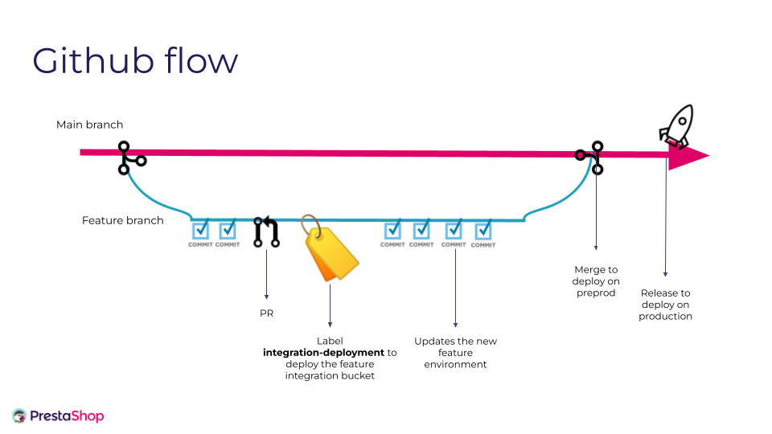

# Kanbanbot

A bot to automatize some repetitive actions on PR's and [PR Dashboard](https://github.com/orgs/PrestaShop/projects/17)

## Requirements and application running

Only php (see the version [here](composer.json)) and a server like apache are needed.

1. Run `composer install`
2. Setup a webserver to serve the root directory of the application. For example use Symfony built-in server with command `symfony serve`

You can also use Docker.

## Functioning

Kanbanbot is mainly based on one webhook. See the following code [here](config/packages/framework.yaml) :
```yaml
webhook:
        routing:
            github:
                service: App\Shared\Infrastructure\Webhook\GithubWebhookParser
```

The production application has been setup so that GitHub send every event that happens on PrestaShop organization to Kanbanbot as [webhook](https://docs.github.com/en/webhooks-and-events/webhooks/about-webhooks).

Kanbanbot listens to received events and then run the appropriate commands.

## How to add a usecase ?

There are two layers to consider when adding a new usecase :
1. The first layout is responsible to match the appropriate commands in terms of the triggered event. To do that you have to 
create a new class which implements [App\Shared\Infrastructure\Factory\CommandFactory\CommandStrategyInterface.php](src/Shared/Infrastructure/Factory/CommandFactory/CommandStrategyInterface.php).
You can see some examples in the [src/Shared/Infrastructure/Factory/CommandFactory/Strategy/Command](src/Shared/Infrastructure/Factory/CommandFactory/Strategy/Command) folder.
In this layer you can also add global github event exclusions. To do that you can create a new class which implements [App\Shared\Infrastructure\Factory\CommandFactory\ExclusionStrategyInterface.php](src/Shared/Infrastructure/Factory/CommandFactory/ExclusionStrategyInterface.php). You can see some examples in the [src/Shared/Infrastructure/Factory/CommandFactory/Strategy/Exclusion](src/Shared/Infrastructure/Factory/CommandFactory/Strategy/Exclusion) folder.
2. The second layout contains the commands themselves. They are dispatched in several Bounded context like in [PullRequest](src/PullRequest/Application/CommandHandler) and in [PullRequestDashboard](src/PullRequestDashboard/Application/CommandHandler).

## Triage agent

A bounded context under `src/Triage` that proposes a severity for an issue,
against the project's published [bug severity
classification](https://build.prestashop-project.org/news/2019/severity-classification/).
Groundwork for the spike in
[PrestaShop/PrestaShop#42138](https://github.com/PrestaShop/PrestaShop/issues/42138).

**It proposes and never decides.** Nothing here writes a label, a board field
or a comment; a human accepts, corrects or ignores every verdict.

### The rubric is the substance

`src/Triage/Infrastructure/Resources/severity_system.md` reproduces the
published classification verbatim, then adds what that page leaves open: how
to read its "percentage of users" thresholds for a shop platform, the clauses
that override the count, and how to judge whether a workaround is obvious. It
also encodes the boundary the QA team draws in [how issues are
sorted](https://www.prestashop-project.org/get-involved/report-issues/how-issues-are-sorted/):
severity is proposed, priority never is.

Three of its rules come from measurement rather than reasoning, and carry
their numbers in the text:

- **Narrowness of scope separates Major from Critical.** Naming a specific
  module appears in 59% of Criticals but 76% of Majors.
- **The symptom is not the severity.** An exception or a 500 appears in 31% of
  Criticals and 34% of Majors, so it discriminates nothing. A rubric clause
  built on it once produced 89% false positives.
- **Security and data loss are the only markers that separate the classes**
  (38% against 20%, and 40% against 25%).

`severity_examples.md` holds worked examples mined from closed issues that
maintainers labelled themselves.

### Measuring it

```bash
php bin/console app:triage:calibrate --limit=20              # cheap smoke test
php bin/console app:triage:calibrate                         # the whole held-out set
php bin/console app:triage:calibrate --limit=40 --repeat=3   # how much of a move is noise
```

Also `.github/workflows/triagecalibrate.yml`, **manual only**. Run it when the
rubric changes, not on a schedule. The split seed is fixed, so two runs are
directly comparable and this doubles as a regression test on the prompt.

There is no fine-tuning. The closed issues carrying exactly one severity
label are split once, deterministically and stratified by class, into a pool
the worked examples are mined from and a held-out set that is scored and never
appears in a prompt. Mining from the held-out half would hand over the
answers.

Read the intervals, not the point estimates. Each rate is computed from a few
dozen items, so the 95% intervals the report prints are wide, and two rubrics
whose intervals overlap have not been shown to differ however far apart their
headline numbers look. Those intervals cover sampling error on the held-out
set only. Inference is not deterministic either, which is what `--repeat`
measures: the same rubric on the same items, several times, so a move after an
edit can be weighed against the movement that happens with nothing changed.

Read the confusion matrix, not the headline percentage: the corpus is heavily
imbalanced, so answering "Minor" to everything scores well and says nothing.
The two numbers that matter are **Critical recall** (a Critical proposed as
Minor is an issue the sheriff never sees ranked) and **Critical precision**,
because a rubric reaches every Critical by calling everything Critical, and
then people stop reading the section.

### Configuration

`ANTHROPIC_API_KEY` is an organisation secret already shared with this
repository. Without it the classifier fails with a clear message rather than
half-running. The calibration workflow authenticates its GitHub reads with the
automatic per-run token, since everything it reads is public.

## Testing

The whole application is tested. This widely avoids regressions and allows easy refactoring or library updating.

There are three kinds of tests:
1. Unit tests. In this application unit test means that no infrastructure (like db, api calls ...) are used. This allows a really fast execution and then it gives a quick feedback to practice TDD. Also unit tests adopts a functional approach. It means that it tests the behavior of the application and not the implementation. Concretely they test CommandHandler.
[Here is an example](tests/PullRequest/Application/CommandHandler/AddLabelByAapprovalCountCommandHandlerTest.php)
2. Integration tests. They test only adapters like implementations of repositories. [Here is an example](tests/Shared/Infrastructure/Adapter/RestGithubCommitterRepositoryTest.php)
3. EndToEnd tests. They test that commands are well dispatched in terms of the request. [Here is an example](tests/Shared/Infrastructure/Webhook/GithubWebhookTest.php)

## Composer scripts

There are some composer scripts to help you to develop (unit tests, integration tests, end to end tests, code style, phpstan ...).
Before pushing a commit you can run `composer local-ci to` check if everything is ok.

## Deployment of kanbanbot new version

1. Bump the version number in `app.version` variable in the [config/service.php](config/services.php) file!
2. Follow the GitHub workflow described below to deploy latest version of `main` branch

You can verify the deployed version : ping the `/healthcheck` route that will return the version number.

## Environments

* **Production**: kanbanbot.prestashop-project.org

## Workflow

The GitHub workflow is used as follow:



As you can see from the schema above
- add the label "integration-deployment" to a Pull Request to trigger the deployment of the integration environment and be able to test it
- merge a Pull Request against branch `main` to trigger the deployment of the preprod environment and be able to test it
- publish a GitHub release to trigger the deployment of the production environment